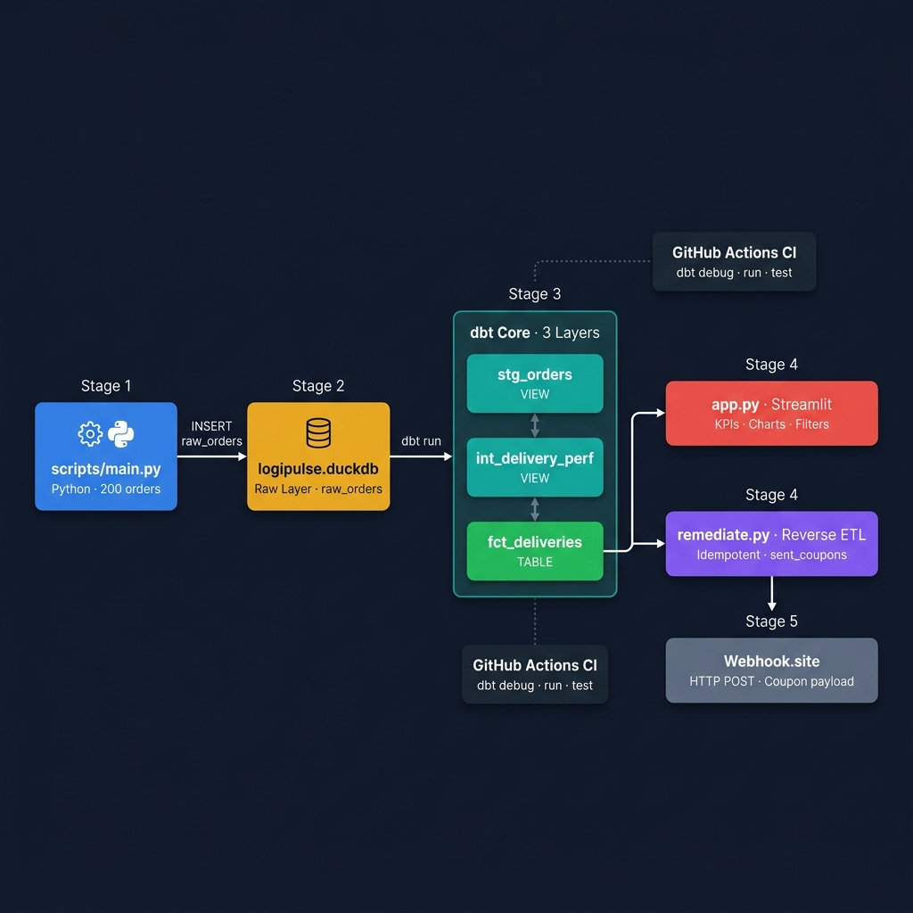

# LogiPulse

[](https://github.com/mikaelpizzi/LogiPulse/actions/workflows/dbt_ci.yml)


**LogiPulse** is a local Modern Data Stack pipeline that detects critical last-mile delivery
delays and automatically triggers compensation coupons for affected users — all running
100% on your machine, with no cloud accounts or paid services required.

---

## Architecture



## How it works

```
Python simulator                      DuckDB (local file)
generates 200 orders  ──────────────► raw_orders table
with rush-hour delays
                                              │
                                    dbt Core (3 SQL layers)
                                              │
                                     stg_orders  (view)
                                              │
                                  int_delivery_perf  (view)
                                     delay > 15 min?
                                              │
                                   fct_deliveries  (table)
                                       ┌──────┴──────┐
                               Streamlit            Reverse ETL
                               dashboard            remediate.py
                               KPIs + charts        coupon HTTP POST
                                                    (idempotent)
```

**Four components in sequence:**

1. **`scripts/main.py`** — Generates 200 deterministic delivery events and loads them into DuckDB. Simulates realistic rush-hour delay spikes (12–14h and 19–21h).
2. **`dbt_project/`** — Three SQL transformation layers: cleans raw data → calculates `delay_minutes` and `is_severely_delayed` → materializes the final fact table.
3. **`app.py`** — Streamlit dashboard with KPI cards, delay distribution histogram, and chronological scatter plot. Supports EN/ES and light/dark themes.
4. **`scripts/remediate.py`** — Reverse ETL: queries `fct_deliveries`, generates a `DISCULPAXmin` coupon per delayed order, and sends an HTTP POST payload to a webhook endpoint. Uses a `sent_coupons` tracking table to guarantee idempotency.

---

## Project layout

```
LogiPulse/
├── .github/workflows/dbt_ci.yml   # CI: installs deps → generates data → dbt run/test
├── dbt_project/
│   ├── models/
│   │   ├── staging/               # stg_orders.sql + schema.yml
│   │   ├── intermediate/          # int_delivery_perf.sql
│   │   └── marts/                 # fct_deliveries.sql + schema.yml
│   ├── dbt_project.yml
│   └── profiles.yml               # DuckDB connection (path: ../logipulse.duckdb)
├── scripts/
│   ├── main.py                    # Ingestion
│   └── remediate.py               # Reverse ETL
├── app.py                         # Streamlit dashboard
└── requirements.txt
```

---

## Data contract

### Raw layer — `raw_orders`

| Column | Type | Description |
|---|---|---|
| `order_id` | VARCHAR | Unique order identifier |
| `user_id` | VARCHAR | Customer identifier |
| `driver_id` | VARCHAR | Driver identifier |
| `status` | VARCHAR | `CREATED`, `ASSIGNED`, `PICKED_UP`, `DELIVERED`, `CANCELLED` |
| `amount` | DOUBLE | Transaction amount |
| `created_at` | VARCHAR | ISO 8601 timestamp |
| `estimated_delivery_minutes` | INTEGER | Promised delivery window |
| `actual_delivery_minutes` | INTEGER | Actual delivery time (NULL if not delivered) |

### Mart layer — `fct_deliveries`

| Column | Type | Description |
|---|---|---|
| `order_id` | VARCHAR | PK |
| `user_id` | VARCHAR | |
| `driver_id` | VARCHAR | |
| `amount` | DOUBLE | |
| `created_at` | TIMESTAMP | |
| `delay_minutes` | INTEGER | `actual - estimated` |
| `is_severely_delayed` | BOOLEAN | `TRUE` if `delay_minutes > 15` |

---

## Local setup

### Requirements

- Python **≥ 3.10** (tested on 3.10 and 3.13)
- Git

### Install

```bash
# Create and activate the virtual environment
python -m venv .venv

# Windows PowerShell
.\.venv\Scripts\activate

# macOS / Linux / WSL
source .venv/bin/activate

# Install dependencies
pip install --upgrade pip
pip install -r requirements.txt
```

---

## Run the full pipeline

> **All commands are run from the project root unless otherwise noted.**

### Step 1 — Generate mock data

```bash
python scripts/main.py
```

Expected output: `Ingestion completed. Total rows in raw_orders: 200`

### Step 2 — Run dbt transformations and tests

> ⚠️ **Important:** dbt commands **must be run from inside `dbt_project/`**.
> `profiles.yml` uses the relative path `../logipulse.duckdb` — running dbt from
> the project root with `--project-dir` resolves this path incorrectly and will
> cause a `Table raw_orders does not exist` error.

```bash
cd dbt_project
dbt debug --profiles-dir .    # verify connection
dbt run   --profiles-dir .    # build stg → int → fct
dbt test  --profiles-dir .    # run 9 data quality tests
cd ..
```

Expected output: `Done. PASS=3 WARN=0 ERROR=0 SKIP=0 TOTAL=3` and `Done. PASS=9 WARN=0 ERROR=0 SKIP=0 TOTAL=9`

### Step 3 — Launch the dashboard

```bash
streamlit run app.py
```

Opens at `http://localhost:8501`.

### Step 4 — Run the Reverse ETL (optional)

Without a webhook URL the script runs in **simulation mode** and prints payloads to the console:

```bash
python scripts/remediate.py
```

To send real HTTP POST requests, set the webhook URL first:

```bash
# Windows PowerShell
$env:LOGIPULSE_WEBHOOK_URL="https://webhook.site/your-unique-id"
python scripts/remediate.py

# macOS / Linux / WSL
export LOGIPULSE_WEBHOOK_URL="https://webhook.site/your-unique-id"
python scripts/remediate.py
```

**Idempotency check:** running the script a second time prints `No new incidents found for remediation.` — no coupon is sent twice.

---

## CI pipeline

The GitHub Actions workflow (`.github/workflows/dbt_ci.yml`) triggers on every push and
pull request to `main`. It:

1. Sets up Python 3.10 on `ubuntu-latest`
2. Installs all Python dependencies
3. Runs `scripts/main.py` to generate a fresh DuckDB database
4. Runs `dbt debug`, `dbt run`, and `dbt test` from inside `dbt_project/`

A green badge at the top of this file confirms the pipeline is passing.

---

## Dashboard features

- **KPI cards:** completed deliveries, critical delays, delay rate, average delay
- **Delay distribution:** histogram with a dashed threshold line at 15 minutes
- **Delay trend:** scatter plot by order time, colored by severity
- **Incident table:** filterable list of critical orders for remediation
- **Filters:** date window, delay range slider, critical-only toggle
- **Bilingual UI:** English / Español
- **Themes:** light and dark mode

---

## Troubleshooting

| Problem | Fix |
|---|---|
| `Table raw_orders does not exist` in dbt | Run `dbt run` from **inside** `dbt_project/`, not the project root |
| `pip install` hangs | Confirm Python 3.10 is active: `python --version` |
| Dashboard shows no data | Rerun `scripts/main.py` and `dbt run` |
| Remediation resends coupons | The `sent_coupons` table may be out of sync; inspect it with `duckdb logipulse.duckdb` |
| dbt cannot find `profiles.yml` | Always pass `--profiles-dir .` when running from inside `dbt_project/` |
